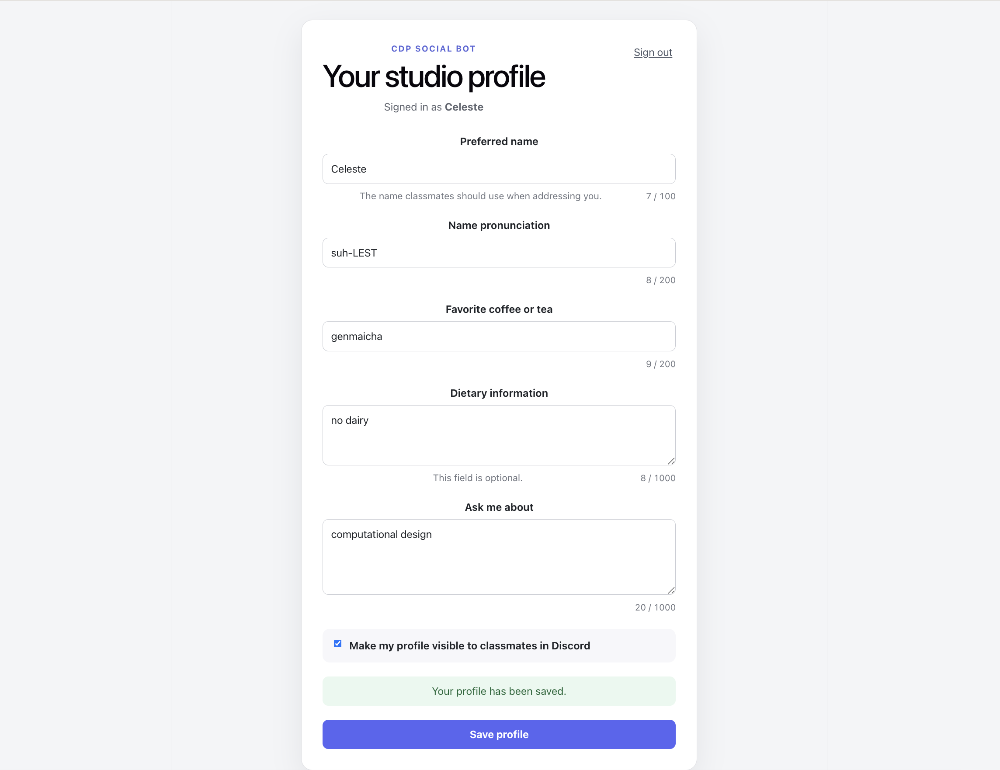

# CDP Social Bot



### Create your profile

1. Open the class profile site: <https://cdp-social-bot.layne-celeste.workers.dev>
2. Click **Sign in with Discord** and approve the request. The bot only reads
   your Discord username and avatar — it cannot post as you or read your
   messages.
3. Fill in as much as you want to share. Only your preferred name is required;
   every other question is optional and can be left blank.
4. Tick **Make my profile visible to classmates in Discord** if you want
   classmates to be able to look you up.
5. Click **Save profile**.

You can come back and edit any time. Your answers load automatically, and
saving again replaces them. Unticking the visibility box hides your profile
again immediately.

**Nothing you write is shown to anyone until you tick that box.** Once ticked,
any classmate in the server can see everything you filled in — including your
dietary information — so share only what you are comfortable with the whole
class seeing.

### Look someone up

Type `/` in any channel in the class Discord server and pick a command.

**`/meet`** — shows a classmate's full profile.

```
/meet student:@Ada
```

The reply is posted in the channel where everyone can see it, and includes
whichever fields that person filled in: how their name is pronounced, their
coffee or tea order, dietary information, and what to ask them about.

**`/pronounce`** — shows just how to say someone's name.

```
/pronounce student:@Ada
```

The reply is visible **only to you**, so you can check quietly before speaking.

### If a lookup doesn't work

| What you see | What it means |
| --- | --- |
| "This student has not created a profile yet." | They haven't filled in the form. |
| "This student's profile is not published." | They filled it in but chose not to share it. |
| "This student has not added a pronunciation." | Their profile is shared, but they left that question blank. |

None of these mean anything is broken. Each one is someone's choice about what
to share.

## For faculty

```
Read docs/FACULTY_SETUP.md
```
